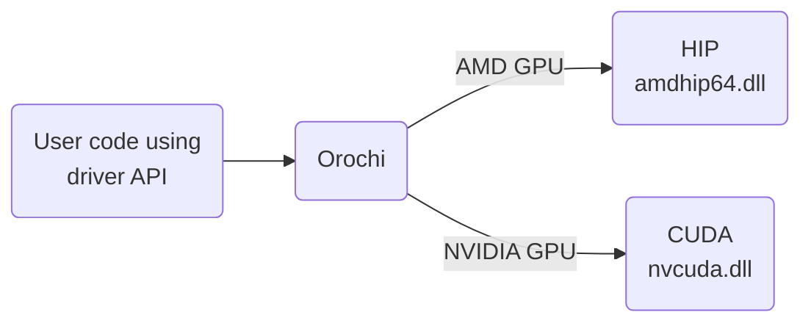

## About

"Yamata No Orochi"<sup>[1]</sup> 

Orochi is a library loading HIP and CUDA APIs dynamically, allowing the user to switch APIs at runtime. Therefore you don't need to compile two separate implementations for each API. This allows you to compile and maintain a single binary that can run on both AMD and NVIDIA GPUs. Unlike HIP, which uses hipamd or CUDA at compile-time, Orochi will dynamically load the corresponding HIP/CUDA shared libraries depending on your platform. In other words, it combines the functionality offered by HIPEW and CUEW into a single library.




---

## Requirement

In order to enable the CUDA backend you need to:
 * Have the CUDA SDK installed ( only the header folder is used by Orochi, at compile-time )
 * Add the CUDA include folder to the Include Directories list of your project.
 * Add the define `OROCHI_ENABLE_CUEW` to your project

For the HIP backend: it's easier as everything needed is embedded in this project, thus you don't need to do anything.

This library doesn't require you to link to CUDA nor HIP at build-time. This provides the benefit that the runtime works even if one of the two drivers, either CUDA or HIP, is installed.

To run an application compiled with Orochi, you need to install a driver of your choice with the corresponding .dll/.so files based on the GPU(s) available. Orochi will automatically link with the corresponding shared library at runtime.

---

## SDK multiple versions support

Orochi will aim to maintain support for various version combinations, enabling developers to switch between branches depending on their environment.

Combinations currently supported:
| HIP version | CUDA version | Branch                                                                                                     | Remarks |
|-------------|--------------|------------------------------------------------------------------------------------------------------------|----------------------------------------------------------|
| 5.7         | 12.2         | [release/hip5.7_cuda12.2](https://github.com/GPUOpen-LibrariesAndSDKs/Orochi/tree/release/hip5.7_cuda12.2) | tested and validated                                     |
| 6.0         | 12.2         | [release/hip6.0_cuda12.2](https://github.com/GPUOpen-LibrariesAndSDKs/Orochi/tree/release/hip6.0_cuda12.2) | tested and validated - HIP Windows DLLs not provided yet |

If you need a combination that is currently not supported, open an [Issue](https://github.com/GPUOpen-LibrariesAndSDKs/Orochi/issues).

----

## API example 

APIs have prefix `oro`. If you are familiar with CUDA or HIP driver APIs, you will get used to Orochi APIs easily.  

For example, suppose we have the following HIP code for device and context creation:

```
#include <hip/hip_runtime.h>

hipInit( 0 );
hipDevice device;
hipDeviceGet( &device, 0 );
hipCtx ctx;
hipCtxCreate( &ctx, 0, device );

```


The same code can be rewritten using Orochi as:


```
#include <Orochi/Orochi.h>

oroInitialize( ORO_API_HIP, 0 );
oroInit( 0 );
oroDevice device;
oroDeviceGet( &device, 0 );
oroCtx ctx;
oroCtxCreate( &ctx, 0, device );
```
Which will run on both CUDA and HIP at runtime!

See more in the [sample application](./Test/main.cpp).

----

## Building Sample Application

Run premake. 

```
./tools/premake5/win/premake5.exe vs2022
```
Note: add the option `--precompiled` to enable precompiled bitcode

Test is a minimum application.

### Test Applications

The test applications run on HIP by default. If you want to run on CUDA, run the app with an arg `cuda`. 

The source code for the test applications can be found [here](./Test/).

----

## Contribution

Feel free to open pull requests.

You can either target a specific `release/` branch or the `main` branch.

If it makes sense, your commit will then be propagated in the different `release/` branches by us.

----

[1] Yamata no Orochi (ヤマタノオロチ, 八岐大蛇) is a legendary eight-headed and eight-tailed Japanese dragon.
